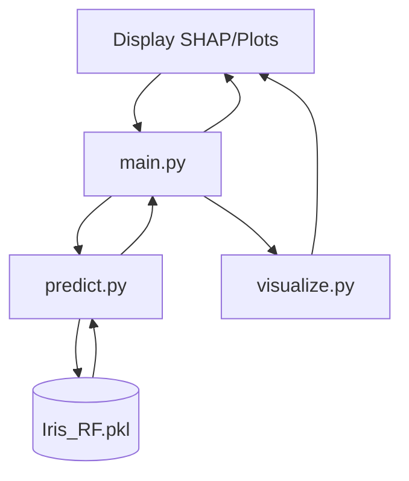

# Architecture Overview

## High-Level Architecture
The Iris Flower Classification application is designed as a monolithic web application powered by Streamlit, leveraging a pre-trained scikit-learn machine learning pipeline.

## Components
1. **User Interface (Streamlit):** Handles user input through forms and sliders, and displays results, metrics, and visualisations.
2. **ML Pipeline:** A scikit-learn pipeline (scaler + model) loaded from `Iris_RF.pkl`. It ensures that input data is preprocessed exactly as the training data was.
3. **Evaluation & Visualization:** Modules (`visualize.py`, `analyze.py`) that generate interactive plots (e.g., Plotly charts, SHAP waterfall charts) for model explainability and data exploration.

## Data Flow
1. User provides input features (Sepal/Petal dimensions).
2. The input is passed to the pre-trained pipeline.
3. The pipeline scales the input and generates a prediction with probability scores.
4. The prediction, along with generated visualisations (SHAP values), is returned to the UI.
